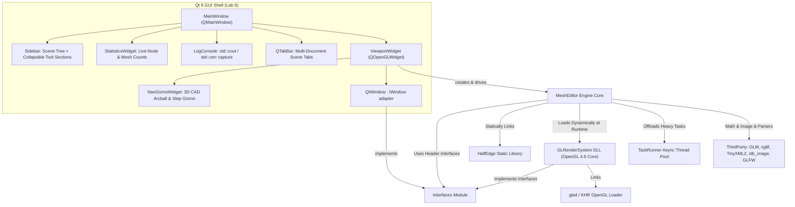
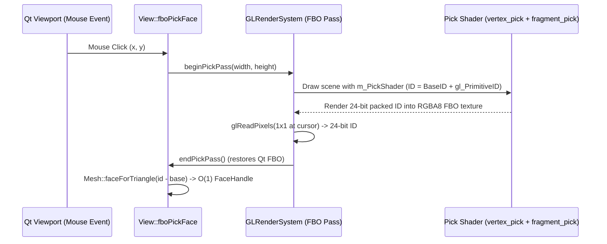
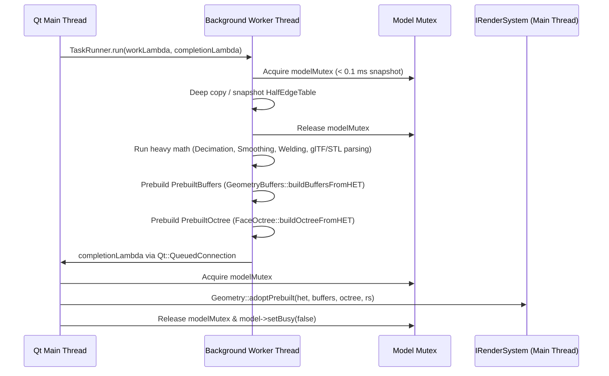

# Project Structure & Architecture Guide

This document provides a comprehensive, exhaustive overview of the design, module dependencies, key algorithms, data structures, concurrency model, rendering pipeline, and UI configuration of the 3D Mesh Editor project. It is structured to help human developers and AI assistants quickly and deeply understand the codebase topology, implementation details, and operational invariants with minimal token overhead.

---

## 1. Project Overview & Module Architecture

The project is an interactive 3D CAD/mesh modeling and rendering workstation application written in standard **C++20**. It enforces a strict separation of concerns, decoupling the rendering backend and windowing system from core mesh topology, scene-graph management, asynchronous task execution, and user-interaction operators through an abstract interface layer and a dynamic shared library (DLL).

The application shell is powered by **Qt 6 Widgets** (`QMainWindow`), hosting a multi-document tabbed GL viewport (`QOpenGLWidget`), collapsible tool sidebars, interactive measurement panels, mesh refinement suites, a CAD navigation cube, a live geometry statistics widget, and a thread-safe stream-redirected log console.



### Module Descriptions

1. **[`Interfaces`](file:///C:/Users/soismatov/Desktop/LABS/FromTriangleToScene6.0Q226Akymenko/Interfaces)**: Header-only/abstract contract declaring the rendering API and window abstractions. Decouples windowing and OpenGL logic from the core application loop.
   * `IRenderSystem.h`: Declares GPU state management, matrix setups, lights, materials, keyed persistent buffer uploads, line rendering, texture mapping, and offscreen colour-id picking.
   * `IWindow.h`: Declares platform-agnostic window dimensions, native file dialogs, and input callbacks.
   * `Keys.h`: Input enum mappings for `KeyCode`, `ButtonCode`, `Action`, and `Modifier`.
2. **[`HalfEdge`](file:///C:/Users/soismatov/Desktop/LABS/FromTriangleToScene6.0Q226Akymenko/HalfEdge)**: Static library implementing a high-performance, index-based, pointerless Half-Edge Table for polygonal and manifold triangle meshes.
   * `HalfEdge.h` / `HalfEdge.cpp`: Implements `HalfEdgeTable`, handle types (`VertexHandle`, `HalfEdgeHandle`, `FaceHandle`), $O(1)$ Swap-Delete face/half-edge removal, twin linkage, localized face deletion, and edge collapse with manifold validation.
3. **[`GLRenderSystem`](file:///C:/Users/soismatov/Desktop/LABS/FromTriangleToScene6.0Q226Akymenko/GLRenderSystem)**: Shared library (`GLRenderSystem.dll`) loaded dynamically at runtime by `DynamicLibrary`.
   * Implements `IRenderSystem` using core-profile OpenGL 4.6 and `glad`.
   * Manages GLSL shader compilation/linking, vertex arrays (VAO), vertex buffers (VBO), and index buffers (IBO/EBO).
   * Houses diffuse/normal/bump **texture objects** keyed by `const void*` and the offscreen **colour-id pick pass** (`beginPickPass` / `drawIndexedForPick` / `readPickId` / `endPickPass`).
4. **[`MeshEditor`](file:///C:/Users/soismatov/Desktop/LABS/FromTriangleToScene6.0Q226Akymenko/MeshEditor)**: Main application executable managing the scene graph, document tabs, asynchronous background tasks, interaction operators, mathematical utilities, file format parsers, and the Qt 6 user interface.

---

## 2. Directory & Complete File Map

```
FromTriangleToScene6.0Q226Akymenko/
├── .agents/
│   └── rules/
│       └── geometry-async-guidelines.md    # Performance & async invariants
├── .github/
│   └── copilot-instructions.md            # Coding standards & style guidelines
├── Interfaces/                            # Abstract interface contracts
│   ├── IRenderSystem.h                    # Abstract rendering backend interface
│   ├── IRenderSystem.cpp                  # Default virtual destructor
│   ├── IWindow.h                          # Abstract windowing & input interface
│   ├── IWindow.cpp                        # Default virtual destructor
│   └── Keys.h                             # Input key/button/modifier enum definitions
├── HalfEdge/                              # Topological mesh data structure library
│   ├── CMakeLists.txt                     # HalfEdge build target configuration
│   ├── HalfEdge.h                         # HalfEdgeTable class and handle structs
│   └── HalfEdge.cpp                       # Twin linking, swap-delete, edge collapses
├── GLRenderSystem/                        # OpenGL 4.6 dynamic rendering backend
│   ├── CMakeLists.txt                     # Shared library build & shader copy rules
│   ├── GLRenderSystem.h                   # IRenderSystem implementation class
│   ├── GLRenderSystem.cpp                 # OpenGL state machine, draw calls, textures, FBO pick
│   ├── GLWindow.h                         # GLFW fallback window adapter
│   ├── GLWindow.cpp                       # GLFW event loop & context implementation
│   ├── Buffer.h / Buffer.cpp              # Base OpenGL buffer wrapper
│   ├── VertexBuffer.h / VertexBuffer.cpp  # VBO wrapper
│   ├── IndexBuffer.h / IndexBuffer.cpp    # EBO/IBO wrapper
│   ├── VertexArray.h / VertexArray.cpp    # VAO wrapper
│   ├── Shader.h / Shader.cpp              # GLSL shader program compilation & uniforms
│   ├── Exports.h / Exports.cpp            # DLL dynamic factory export functions
│   ├── glad/                              # OpenGL loader headers
│   │   └── glad.h
│   ├── KHR/                               # Khronos platform header
│   │   └── khrplatform.h
│   ├── utils/
│   │   ├── glad.c                         # GLAD OpenGL 4.6 loader implementation
│   │   ├── ShaderReader.h                 # Shader file reading helpers
│   │   └── ShaderReader.cpp
│   └── shaders/                           # GLSL Core 4.60 shaders
│       ├── vertex.glsl                    # Main vertex shader: transforms & lighting pass
│       ├── fragment.glsl                  # Phong per-fragment lighting & texturing
│       ├── geometry.glsl                  # Wireframe barycentric coordinate injector
│       ├── mesh_fragment.glsl             # Wireframe overlay fragment shader
│       ├── vertex_pick.glsl               # Position-only MVP transform for FBO picking
│       └── fragment_pick.glsl             # 24-bit RGB packed primitive ID output
├── MeshEditor/                            # Core application engine & Qt UI
│   ├── CMakeLists.txt                     # Executable CMake build & deploy configuration
│   ├── main.cpp                           # Entry point: QSurfaceFormat, QApplication, engine setup
│   ├── Application.h / Application.cpp    # Singleton engine: document tabs, task runner, view lifecycle
│   ├── DynamicLibrary.h / DynamicLibrary.cpp # Win32 LoadLibrary/GetProcAddress DLL loader
│   ├── Contact.h                          # Raycast/pick hit contact structure
│   ├── FilterValue.h                      # Scene raycast filter enum (Node vs Manipulator)
│   ├── Model/                             # Geometric and scene representations
│   │   ├── Geometry/                      # Mesh representations, buffers, acceleration
│   │   │   ├── AABB.h / AABB.cpp          # Axis-Aligned Bounding Box calculation & ray intersection
│   │   │   ├── FaceOctree.h / FaceOctree.cpp # Face-level spatial partitioning & async octree builder
│   │   │   ├── Geometry.h / Geometry.cpp  # Shared mesh data container & atomic adoption pipeline
│   │   │   ├── GeometryBuffers.h / GeometryBuffers.cpp # GPU buffer packing & async prebuilt buffers
│   │   │   ├── Material.h / Material.cpp  # Phong material properties & texture paths
│   │   │   ├── Mesh.h / Mesh.cpp          # Scene mesh instance, selection state, overlay caches
│   │   │   └── Octree.h / Octree.cpp      # OctreeNode struct & slab-method traversal functions
│   │   ├── Graph/                         # Scene hierarchy
│   │   │   ├── Model.h / Model.cpp        # Root scene container, thread mutex, world AABB cache
│   │   │   └── Node.h / Node.cpp          # Hierarchical transform node, child tree, mesh attachment
│   │   ├── Manipulators/                  # 3D interactive transform gizmos
│   │   │   ├── Manipulator.h / Manipulator.cpp # Base gizmo class & hit test
│   │   │   ├── TranslationManipulator.h / .cpp # 3-axis translation gizmo
│   │   │   ├── RotationManipulator.h / .cpp    # 3-ring rotation gizmo
│   │   │   ├── ScaleManipulator.h / .cpp       # 3-box uniform/non-uniform scale gizmo
│   │   │   └── Triad.h / Triad.cpp             # Combined Translate-Rotate-Scale CAD gizmo
│   │   └── IO/                            # Scene persistence dispatches
│   │       ├── SceneIO.h                  # Format dispatcher (COLLADA, STL, glTF)
│   │       └── SceneIO.cpp                # File format routing, pastel coloring, soup warming
│   ├── Operators/                         # Input state machines & interaction tools
│   │   ├── Operator.h / Operator.cpp      # Abstract operator base class
│   │   ├── OperatorDispatcher.h / .cpp    # Input routing, exclusivity, and modal dispatch
│   │   ├── ManipulatorOperator.h / .cpp   # Base for gizmo-driven operators (constant screen size)
│   │   ├── Camera/                        # Camera navigation operators
│   │   │   ├── CameraPreset.h / .cpp      # F1-F7 camera snap presets
│   │   │   ├── FpsCamera.h / .cpp         # WASD + mouse capture first-person camera (F10)
│   │   │   ├── KeyboardOrbit.h / .cpp     # Animated 15° arcball orbit steps via arrow keys
│   │   │   ├── Pan.h / .cpp               # Mouse left-drag viewport panning
│   │   │   ├── ToggleProjection.h / .cpp  # F8 perspective/parallel toggle
│   │   │   ├── TrackBall.h / .cpp         # Mouse right-drag arcball rotation
│   │   │   └── ZoomToModel.h / .cpp       # F / F9 zoom-to-fit bounding box
│   │   ├── Display/                       # Visual overlay toggle operators
│   │   │   ├── ColorHoles.h / .cpp        # H key: boundary edge hole highlighting
│   │   │   ├── PaintBoundaryFaces.h / .cpp# L key: boundary-adjacent face highlighting
│   │   │   ├── ToggleAABB.h / .cpp        # J key: scene bounding box rendering
│   │   │   ├── ToggleBlackEdges.h / .cpp  # R key: geometry shader wireframe overlay
│   │   │   ├── ToggleMeshFlagOperator.h / .cpp # Generic mesh boolean flag toggle base
│   │   │   └── ToggleOctree.h / .cpp      # G key: octree bounding box visualization
│   │   ├── Editing/                       # Interactive mesh manipulation tools
│   │   │   ├── EditFace.h / .cpp          # Y key: full Triad manipulator on selected face
│   │   │   ├── EditMesh.h / .cpp          # E key: face extrusion / offset manipulator
│   │   │   ├── EditVertex.h / .cpp        # V key: individual vertex translation manipulator
│   │   │   ├── ScaleNode.h / .cpp         # B key: node scale manipulator
│   │   │   └── TransformNode.h / .cpp     # T key: node translation manipulator
│   │   ├── IO/                            # File operation operators
│   │   │   ├── LoadScene.h / .cpp         # O / Ctrl+O: async scene loader (creates new tab)
│   │   │   └── SaveScene.h / .cpp         # S key: native Save As COLLADA exporter
│   │   ├── Measurement/                   # Interactive 3D measurement operators
│   │   │   ├── AngleMeasurementOperator.h / .cpp    # A key: 2-face normal angle measurement
│   │   │   ├── DistanceMeasurementOperator.h / .cpp # M key: 2-point distance with live preview line
│   │   │   └── EdgeMeasurementOperator.h / .cpp     # U key: face edge length measurement
│   │   ├── Refinement/                    # Asynchronous mesh processing operators
│   │   │   ├── DecimateOperator.h / .cpp  # 4 key: async 50% edge-collapse decimation
│   │   │   ├── LaplacianSmoothOperator.h / .cpp # 1 key: async 1-ring Laplacian smoothing
│   │   │   ├── RemoveDegenerateFacesOperator.h / .cpp # 2 key: async zero-area face removal
│   │   │   └── WeldVerticesOperator.h / .cpp # 3 key: async O(N log N) vertex snapping
│   │   ├── Selection/                     # Face selection & deletion
│   │   │   ├── DeleteFaces.h / .cpp       # Del / Backspace: async selected face deletion
│   │   │   └── SelectFaces.h / .cpp       # Middle click / Shift+Drag face picking
│   │   └── Topology/                      # Bulk geometric operations
│   │       ├── MoveEvenFaces.h / .cpp     # Translates even-indexed faces
│   │       └── MoveOrthogonalFaces.h / .cpp # N key: translates orthogonal faces
│   ├── QtUI/                              # Qt 6 Widgets UI Shell
│   │   ├── Adapters/
│   │   │   ├── QtKeyMap.h / QtKeyMap.cpp  # Qt key/mouse codes to IWindow KeyCode/ButtonCode
│   │   │   └── QtWindow.h / QtWindow.cpp  # IWindow implementation wrapping ViewportWidget
│   │   ├── Console/
│   │   │   ├── LogConsole.h / LogConsole.cpp # Integrated QPlainTextEdit terminal widget
│   │   │   └── LogConsoleBuffer.h / .cpp  # Thread-safe std::streambuf redirector for cout/cerr
│   │   ├── Dialogs/
│   │   │   └── ShortcutsDialog.h / .cpp   # Keyboard & mouse shortcut reference dialog
│   │   └── Widgets/
│   │       ├── CollapsibleSection.h / .cpp # Animated collapsible accordion container widget
│   │       ├── MainWindow.h / MainWindow.cpp # Main QMainWindow: menu, sidebars, tabs, splitters
│   │       ├── NavGizmoWidget.h / .cpp    # Top-right 3D navigation cube & 15° step buttons
│   │       ├── StatisticsWidget.h / .cpp  # Live node name, vertex count, and face count panel
│   │       └── ViewportWidget.h / .cpp    # QOpenGLWidget embedding the engine View & frame timer
│   ├── Threading/                         # Asynchronous task system
│   │   ├── TaskRunner.h / TaskRunner.cpp  # Background worker thread pool with Qt UI completion dispatch
│   │   └── TaskTypes.h                    # TaskHandle cancellation token & progress types
│   ├── utils/                             # Geometry generators & format parsers
│   │   ├── ColladaParser.h / .cpp         # TinyXML2 COLLADA (.dae) loader & exporter
│   │   ├── CreatePrimitives.h / .cpp      # Parametric Cube, Sphere, Cylinder, Cone, Torus, Axes
│   │   ├── GLTFParser.h / .cpp            # glTF 2.0 / GLB loader via cgltf
│   │   ├── MathUtils.h / .cpp             # Plane intersection, angle wrapping, vector rotations
│   │   ├── stb_impl.cpp                   # stb_image single translation unit implementation
│   │   └── STLParser.h / .cpp             # ASCII & Binary STL parser with hash vertex welding
│   └── View/                              # Viewport, camera, and picking mathematics
│       ├── Camera.h / Camera.cpp          # LookAt, Arcball orbit, zoom, WASD FPS, smooth transitions
│       ├── View.h / View.cpp              # Scene renderer, operator host, Octree & FBO pick passes
│       ├── ViewPort.h / ViewPort.cpp      # Perspective/parallel projection matrices, ray unprojection
│       └── ViewUtils.h / ViewUtils.cpp    # zoomViewToModel, scene bounding box calculation
├── ThirdParty/                            # Vendored external dependencies
│   ├── cgltf.h                            # Single-header glTF 2.0 parser/writer
│   ├── glfw/                              # GLFW 3 library & headers
│   ├── glm/                               # OpenGL Mathematics (GLM) header-only library
│   ├── stb/                               # stb_image.h v2.30 image loader
│   └── tinyxml2/                          # TinyXML-2 XML parser
├── CMakeLists.txt                         # Root CMake project configuration
├── CMakePresets.json                      # VS & CMake build presets
├── CMakeSettings.json                     # Visual Studio CMake settings
├── Makefile                               # Build automation Makefile (VS2022 / Ninja / MSVC)
├── make.cmd                               # Windows Makefile launcher shim
└── README.md                              # Repository introduction
```

---

## 3. Core Algorithms & Data Structures

### A. Half-Edge Table Topology Management ([`HalfEdgeTable`](file:///C:/Users/soismatov/Desktop/LABS/FromTriangleToScene6.0Q226Akymenko/HalfEdge/HalfEdge.h#L46-L130))

To guarantee maximum CPU cache locality and zero pointer-chasing overhead, all mesh elements (vertices, half-edges, faces) are stored in flat, index-aligned contiguous arrays (`std::vector`).

```
  Vertex (i)  ──>  HalfEdge (heh)  ──>  Face (fh)
       │                 │                   │
       ▼                 ▼                   ▼
  m_positions[i]     m_uvs[heh]          m_faces[fh]
```

* **Structure-of-Arrays (SoA) Layout**:
  - `m_vertices`: Stores [`HalfEdgeVertex`](file:///C:/Users/soismatov/Desktop/LABS/FromTriangleToScene6.0Q226Akymenko/HalfEdge/HalfEdge.h#L41-L44) containing only the outgoing `heh` handle.
  - `m_positions`: Stores `glm::vec3` coordinates, index-aligned with `m_vertices`.
  - `m_halfEdges`: Stores [`HalfEdge`](file:///C:/Users/soismatov/Desktop/LABS/FromTriangleToScene6.0Q226Akymenko/HalfEdge/HalfEdge.h#L27-L34) records (`fh`, `dst`, `twin`, `next`, `prev`).
  - `m_uvs`: Stores per-corner `glm::vec2` texture coordinates, index-aligned with `m_halfEdges`. Per-corner UVs on half-edges allow seamless texturing and UV seams across shared vertices.
  - `m_faces`: Stores [`Face`](file:///C:/Users/soismatov/Desktop/LABS/FromTriangleToScene6.0Q226Akymenko/HalfEdge/HalfEdge.h#L36-L39) records containing the root half-edge `heh`.

* **$O(1)$ Swap-Delete Topology Compaction**:
  When element $i$ is deleted, the last element in the array is moved to index $i$, and the array is popped. All handles pointing to the former tail element are patched in $O(1)$:
  - Twin link: `m_halfEdges[moved.twin.index].twin = heIndex`
  - Next/Prev links: `m_halfEdges[moved.next.index].prev = heIndex` and `m_halfEdges[moved.prev.index].next = heIndex`
  - Vertex reference: `m_vertices[movedSourceVertex].heh = heIndex`
  - Face reference: `m_faces[moved.fh.index].heh = heIndex`

* **Twin Connectivity (`connectTwins`)**:
  - `connectTwinsFindAndCreate`: Hashes coordinate pairs `{srcVertex, dstVertex}` into `m_edgeMap`. Opposing twin edges `{dstVertex, srcVertex}` are paired. Unmatched edges generate boundary half-edges with `fh = -1`.
  - `connectTwinsLinkBoundaries`: Connects boundary half-edges sequentially into closed circular loops.

* **Edge Collapse & Manifold Validation ([`canCollapse`](file:///C:/Users/soismatov/Desktop/LABS/FromTriangleToScene6.0Q226Akymenko/HalfEdge/HalfEdge.h#L61) & [`collapseEdge`](file:///C:/Users/soismatov/Desktop/LABS/FromTriangleToScene6.0Q226Akymenko/HalfEdge/HalfEdge.h#L62))**:
  - Evaluates topological invariants before edge collapse:
    1. **Link Condition**: The intersection of the 1-ring neighborhoods of vertex $u$ (source) and vertex $v$ (destination) must equal exactly the two vertices sharing the edge's adjacent faces.
    2. **Boundary Protection**: Prevents collapsing boundary vertices into interior vertices.
    3. **Normal Inversion Check**: Ensures adjacent face normals do not flip after moving $u$ to $v$.
  - Executes collapse: merges $u$ into $v$, removes the two collapsed triangles, updates all incident half-edge destination pointers, and splices out dead twin pairs.

---

### B. Octree Spatial Partitioning ([`FaceOctree`](file:///C:/Users/soismatov/Desktop/LABS/FromTriangleToScene6.0Q226Akymenko/MeshEditor/Model/Geometry/FaceOctree.h#L22-L61) & [`Octree`](file:///C:/Users/soismatov/Desktop/LABS/FromTriangleToScene6.0Q226Akymenko/MeshEditor/Model/Geometry/Octree.h))

Face raycasting is accelerated by a spatial octree hierarchy.
* **Octree Construction**: Subdivides the mesh bounding box into 8 octants when the face count exceeds `octreeMinFaces = 8` up to `octreeMaxDepth = 6`.
* **Slab-Method Ray-AABB Intersection**:
  $$\text{tMin} = \max(\text{tMin}, \min(t_0, t_1)), \quad \text{tMax} = \min(\text{tMax}, \max(t_0, t_1))$$
* **Loose Face Acceleration**: Faces modified dynamically during editing or translation are placed into `m_looseFaces` for immediate raycasting without requiring an instant full-tree rebuild.

---

### C. FBO Colour-ID GPU Picking Pipeline

In addition to CPU octree raycasting, the engine provides an $O(1)$ GPU-accelerated face selection backend via offscreen FBO rendering (`View::setPickMode(PickMode::Fbo)`):



1. **Draw Phase**: Draws scene meshes with `m_PickShader` (`vertex_pick.glsl` + `fragment_pick.glsl`), skipping manipulator gizmos. Each mesh receives a contiguous base ID range.
2. **Fragment Output**: `fragment_pick.glsl` computes `id = uBaseId + gl_PrimitiveID` and encodes it across RGB channels. Dithering and blending are strictly disabled.
3. **Readback & O(1) Triangle-to-Face Resolution**: Reads 1 pixel via `glReadPixels`. The local triangle index (`id - base`) maps directly to a `FaceHandle` in $O(1)$ time via `GeometryBuffers::getTriangleToFace()`.
4. **Deferred Mouse Event Queue**: Mouse inputs in FBO mode are queued in `ViewportWidget::m_pendingMouse` and replayed inside `paintGL()` when the GL context is active, preventing per-move context switch overhead.

---

### D. Mesh Refinement Algorithms ([`MeshEditor/Operators/Refinement`](file:///C:/Users/soismatov/Desktop/LABS/FromTriangleToScene6.0Q226Akymenko/MeshEditor/Operators/Refinement))

All mesh refinement operations execute asynchronously on background worker threads and adopt prebuilt buffers atomically on the main thread:

* **Laplacian Smoothing ([`LaplacianSmoothOperator`](file:///C:/Users/soismatov/Desktop/LABS/FromTriangleToScene6.0Q226Akymenko/MeshEditor/Operators/Refinement/LaplacianSmoothOperator.h), Key `1`)**:
  Computes umbrella operator displacement for every vertex $v_i$:
  $$\mathbf{p}_i^{(t+1)} = \frac{1}{|\mathcal{N}(i)|} \sum_{j \in \mathcal{N}(i)} \mathbf{p}_j^{(t)}$$
  Iterates over the 1-ring neighborhood in $O(\text{valence})$ using outgoing half-edge circulation.
* **Degenerate Face Removal ([`RemoveDegenerateFacesOperator`](file:///C:/Users/soismatov/Desktop/LABS/FromTriangleToScene6.0Q226Akymenko/MeshEditor/Operators/Refinement/RemoveDegenerateFacesOperator.h), Key `2`)**:
  Calculates face area via cross-product:
  $$\text{Area} = \frac{1}{2} \| (\mathbf{p}_1 - \mathbf{p}_0) \times (\mathbf{p}_2 - \mathbf{p}_0) \|$$
  Faces with $\text{Area} < 10^{-6}$ or fewer than 3 vertices are deleted in descending index order via `deleteFaceLocally`.
* **Vertex Welding ([`WeldVerticesOperator`](file:///C:/Users/soismatov/Desktop/LABS/FromTriangleToScene6.0Q226Akymenko/MeshEditor/Operators/Refinement/WeldVerticesOperator.h), Key `3`)**:
  Executes an $O(N \log N)$ sort-sweep along the X-axis: sorts vertex indices by $x$-coordinate and evaluates pairs where $|x_j - x_i| \le \epsilon$. If $\|\mathbf{p}_i - \mathbf{p}_j\|^2 < \epsilon^2$ ($\epsilon = 10^{-4}$), $v_j$ snaps to $v_i$.
* **Mesh Decimation ([`DecimateOperator`](file:///C:/Users/soismatov/Desktop/LABS/FromTriangleToScene6.0Q226Akymenko/MeshEditor/Operators/Refinement/DecimateOperator.h), Key `4`)**:
  Targets a 50% reduction in live face count: extracts interior candidate half-edges, sorts them by squared edge length $\|\mathbf{p}_{\text{src}} - \mathbf{p}_{\text{dst}}\|^2$, verifies `canCollapse(heh)`, and collapses valid shortest edges until target count is reached.

---

### E. Interactive 3D Measurement Tools ([`MeshEditor/Operators/Measurement`](file:///C:/Users/soismatov/Desktop/LABS/FromTriangleToScene6.0Q226Akymenko/MeshEditor/Operators/Measurement))

* **Distance Measurement ([`DistanceMeasurementOperator`](file:///C:/Users/soismatov/Desktop/LABS/FromTriangleToScene6.0Q226Akymenko/MeshEditor/Operators/Measurement/DistanceMeasurementOperator.h), Key `M`)**: Two-click operator. First left-click raycasts the start point on the mesh surface; mouse hover draws a real-time dynamic polyline segment to the candidate point; second left-click locks the end point and logs the Euclidean distance in world units.
* **Angle Measurement ([`AngleMeasurementOperator`](file:///C:/Users/soismatov/Desktop/LABS/FromTriangleToScene6.0Q226Akymenko/MeshEditor/Operators/Measurement/AngleMeasurementOperator.h), Key `A`)**: Selects two faces, transforms their local geometric face normals into world space via the node's absolute transform matrix inverse-transpose, and computes the dihedral angle:
  $$\theta = \arccos\left(\frac{\mathbf{n}_1 \cdot \mathbf{n}_2}{\|\mathbf{n}_1\| \|\mathbf{n}_2\|}\right) \times \frac{180^\circ}{\pi}$$
* **Edge Measurement ([`EdgeMeasurementOperator`](file:///C:/Users/soismatov/Desktop/LABS/FromTriangleToScene6.0Q226Akymenko/MeshEditor/Operators/Measurement/EdgeMeasurementOperator.h), Key `U`)**: Picks a face and determines the edge closest to the ray intersection point, displaying its length in world space and highlighting the selected segment.

---

## 4. Asynchronous Task Architecture & Concurrency Model

To maintain a guaranteed **60 FPS** UI and rendering framerate without stutter or UI stalls during heavy operations, CPU-heavy tasks are offloaded to [`TaskRunner`](file:///C:/Users/soismatov/Desktop/LABS/FromTriangleToScene6.0Q226Akymenko/MeshEditor/Threading/TaskRunner.h#L24-L56).



### Concurrency Rules & Invariants ([`geometry-async-guidelines.md`](file:///C:/Users/soismatov/Desktop/LABS/FromTriangleToScene6.0Q226Akymenko/.agents/rules/geometry-async-guidelines.md))

1. **Prebuilding Pipeline**: Background workers MUST prebuild both [`PrebuiltBuffers`](file:///C:/Users/soismatov/Desktop/LABS/FromTriangleToScene6.0Q226Akymenko/MeshEditor/Model/Geometry/GeometryBuffers.h#L22-L28) (`GeometryBuffers::buildBuffersFromHET`) and [`PrebuiltOctree`](file:///C:/Users/soismatov/Desktop/LABS/FromTriangleToScene6.0Q226Akymenko/MeshEditor/Model/Geometry/FaceOctree.h#L14-L20) (`FaceOctree::buildOctreeFromHET`) before signaling completion.
2. **Atomic Main-Thread Adoption**: The main thread completion handler adopts prebuilt structures in $O(1)$ via [`Geometry::adoptPrebuilt()`](file:///C:/Users/soismatov/Desktop/LABS/FromTriangleToScene6.0Q226Akymenko/MeshEditor/Model/Geometry/Geometry.h#L71-L74) or [`Geometry::adoptPrebuiltPositions()`](file:///C:/Users/soismatov/Desktop/LABS/FromTriangleToScene6.0Q226Akymenko/MeshEditor/Model/Geometry/Geometry.h#L76-L78).
3. **No Redundant Invalidation**: Never call `markDirty()` or `markGeometryDirty()` after `adoptPrebuilt()`, as that would wipe the newly adopted octree and force a redundant GPU re-upload.
4. **Microscopic Snapshot Locks**: In `onEnter()` / `onKeyboardInput()`, never copy large containers on the UI thread. The background worker acquires `modelMutex` inside its own lambda for $< 0.1\text{ ms}$ to take the snapshot.
5. **Continuous Rendering**: [`View::update()`](file:///C:/Users/soismatov/Desktop/LABS/FromTriangleToScene6.0Q226Akymenko/MeshEditor/View/View.cpp#L105-L150) uses `std::lock_guard<std::mutex> lock(m_model->getModelMutex())`. Because worker locks are microscopic, frame drops and model flickering are completely eliminated.

---

## 5. Input Configuration & Operator Registry

Input events are managed by [`OperatorDispatcher`](file:///C:/Users/soismatov/Desktop/LABS/FromTriangleToScene6.0Q226Akymenko/MeshEditor/Operators/OperatorDispatcher.h#L15-L77). Gizmo-spawning editing tools and measurement tools enforce **mutual exclusion** via [`Operator::isExclusiveTool()`](file:///C:/Users/soismatov/Desktop/LABS/FromTriangleToScene6.0Q226Akymenko/MeshEditor/Operators/Operator.h#L24).

### Complete Input Binding Table

| Input / Shortcut | Operator Class | Type | Functional Description |
| :--- | :--- | :--- | :--- |
| **Mouse Left Drag** | [`Pan`](file:///C:/Users/soismatov/Desktop/LABS/FromTriangleToScene6.0Q226Akymenko/MeshEditor/Operators/Camera/Pan.h) | Button | Pans the camera across the view plane. |
| **Mouse Right Drag** | [`TrackBall`](file:///C:/Users/soismatov/Desktop/LABS/FromTriangleToScene6.0Q226Akymenko/MeshEditor/Operators/Camera/TrackBall.h) | Button | Arcball orbit around camera target. |
| **Mouse Middle Click** | [`SelectFacesOperator`](file:///C:/Users/soismatov/Desktop/LABS/FromTriangleToScene6.0Q226Akymenko/MeshEditor/Operators/Selection/SelectFaces.h) | Button | Picks face under cursor (Octree raycast or FBO colour-id). **Shift+Click** adds to selection; **Shift+Drag** continuously accumulates. |
| **Mouse Scroll Wheel** | (Viewport Hook) | Scroll | Smooth camera zoom in / zoom out. |
| **Arrow Left / Right** | [`KeyboardOrbitOperator`](file:///C:/Users/soismatov/Desktop/LABS/FromTriangleToScene6.0Q226Akymenko/MeshEditor/Operators/Camera/KeyboardOrbit.h) | Key | Animated 15° arcball orbit step left/right around camera up axis. |
| **Arrow Up / Down** | [`KeyboardOrbitOperator`](file:///C:/Users/soismatov/Desktop/LABS/FromTriangleToScene6.0Q226Akymenko/MeshEditor/Operators/Camera/KeyboardOrbit.h) | Key | Animated 15° arcball orbit step up/down around camera right axis. |
| **F1 – F7** | [`CameraPresetOperator`](file:///C:/Users/soismatov/Desktop/LABS/FromTriangleToScene6.0Q226Akymenko/MeshEditor/Operators/Camera/CameraPreset.h) | Key | Snaps camera view (F1: Front, F2: Rear, F3: Right, F4: Left, F5: Top, F6: Bottom, F7: Isometric). |
| **F8** | [`ToggleProjectionOperator`](file:///C:/Users/soismatov/Desktop/LABS/FromTriangleToScene6.0Q226Akymenko/MeshEditor/Operators/Camera/ToggleProjection.h) | Key | Toggles between Perspective and Orthographic (Parallel) projection. |
| **F9 / F** | [`ZoomToModelOperator`](file:///C:/Users/soismatov/Desktop/LABS/FromTriangleToScene6.0Q226Akymenko/MeshEditor/Operators/Camera/ZoomToModel.h) | Key | Frames the scene bounding box to fit the viewport. |
| **F10** | [`FpsCameraOperator`](file:///C:/Users/soismatov/Desktop/LABS/FromTriangleToScene6.0Q226Akymenko/MeshEditor/Operators/Camera/FpsCamera.h) | Enter/Exit | First-person WASD navigation with captured mouse look. |
| **F11** | (MainWindow slot) | Key | Toggles window between Fullscreen and Maximized mode. |
| **O / Ctrl+O** | [`LoadSceneOperator`](file:///C:/Users/soismatov/Desktop/LABS/FromTriangleToScene6.0Q226Akymenko/MeshEditor/Operators/IO/LoadScene.h) | Key | Asynchronously loads `.dae`, `.stl`, `.gltf`, `.glb` into a **new scene tab**. |
| **S** | [`SaveSceneOperator`](file:///C:/Users/soismatov/Desktop/LABS/FromTriangleToScene6.0Q226Akymenko/MeshEditor/Operators/IO/SaveScene.h) | Key | Opens native dialog and exports active scene to COLLADA `.dae`. |
| **Backspace / Del** | [`DeleteSelectedFacesOperator`](file:///C:/Users/soismatov/Desktop/LABS/FromTriangleToScene6.0Q226Akymenko/MeshEditor/Operators/Selection/DeleteFaces.h) | Key | Asynchronously deletes selected faces, updating topology and octree. |
| **Esc** | (Dispatcher Hook) | Key | Deactivates active tool/operator. Exits application if no operator is active. |
| **R** | [`ToggleBlackEdgesOperator`](file:///C:/Users/soismatov/Desktop/LABS/FromTriangleToScene6.0Q226Akymenko/MeshEditor/Operators/Display/ToggleBlackEdges.h) | Key | Toggles wireframe black-edge overlay via geometry shader. |
| **H** | [`ColorHolesOperator`](file:///C:/Users/soismatov/Desktop/LABS/FromTriangleToScene6.0Q226Akymenko/MeshEditor/Operators/Display/ColorHoles.h) | Key | Highlights topological boundary loops/holes in yellow. |
| **L** | [`PaintBoundaryFacesOperator`](file:///C:/Users/soismatov/Desktop/LABS/FromTriangleToScene6.0Q226Akymenko/MeshEditor/Operators/Display/PaintBoundaryFaces.h) | Key | Highlights faces adjacent to boundary edges in red. |
| **G** | [`ToggleOctreeOperator`](file:///C:/Users/soismatov/Desktop/LABS/FromTriangleToScene6.0Q226Akymenko/MeshEditor/Operators/Display/ToggleOctree.h) | Key | Renders bounding boxes of all face octree nodes. |
| **P** | [`TogglePbrOperator`](file:///C:/Users/soismatov/Desktop/LABS/FromTriangleToScene6.0Q226Akymenko/MeshEditor/Operators/Display/TogglePbrOperator.h) | Key | Toggles between Physically Based Rendering (PBR) and Standard Phong face shading. |
| **R** | [`ToggleBlackEdgesOperator`](file:///C:/Users/soismatov/Desktop/LABS/FromTriangleToScene6.0Q226Akymenko/MeshEditor/Operators/Display/ToggleBlackEdges.h) | Key | Toggles black-edge wireframe overlay. |
| **H** | [`ColorHolesOperator`](file:///C:/Users/soismatov/Desktop/LABS/FromTriangleToScene6.0Q226Akymenko/MeshEditor/Operators/Display/ColorHoles.h) | Key | Highlights boundary loop edges around mesh holes in red. |
| **L** | [`PaintBoundaryFacesOperator`](file:///C:/Users/soismatov/Desktop/LABS/FromTriangleToScene6.0Q226Akymenko/MeshEditor/Operators/Display/PaintBoundaryFaces.h) | Key | Toggles boundary face highlighting. |
| **G** | [`ToggleOctreeOperator`](file:///C:/Users/soismatov/Desktop/LABS/FromTriangleToScene6.0Q226Akymenko/MeshEditor/Operators/Display/ToggleOctree.h) | Key | Renders the spatial partitioning hierarchy boxes of the FaceOctree. |
| **J** | [`ToggleAABBOperator`](file:///C:/Users/soismatov/Desktop/LABS/FromTriangleToScene6.0Q226Akymenko/MeshEditor/Operators/Display/ToggleAABB.h) | Key | Renders the Axis-Aligned Bounding Box (AABB) of the model. |
| **E** | [`EditMeshOperator`](file:///C:/Users/soismatov/Desktop/LABS/FromTriangleToScene6.0Q226Akymenko/MeshEditor/Operators/Editing/EditMesh.h) | Exclusive | Spawns translation manipulator to extrude/offset selected faces. |
| **V** | [`EditVertexOperator`](file:///C:/Users/soismatov/Desktop/LABS/FromTriangleToScene6.0Q226Akymenko/MeshEditor/Operators/Editing/EditVertex.h) | Exclusive | Spawns translation manipulator on picked vertex. |
| **Y** | [`EditFaceOperator`](file:///C:/Users/soismatov/Desktop/LABS/FromTriangleToScene6.0Q226Akymenko/MeshEditor/Operators/Editing/EditFace.h) | Exclusive | Spawns complete CAD [`Triad`](file:///C:/Users/soismatov/Desktop/LABS/FromTriangleToScene6.0Q226Akymenko/MeshEditor/Model/Manipulators/Triad.h) (translate, rotate, scale) on a selected face. |
| **T** | [`TransformMeshOperator`](file:///C:/Users/soismatov/Desktop/LABS/FromTriangleToScene6.0Q226Akymenko/MeshEditor/Operators/Editing/TransformNode.h) | Exclusive | Spawns translation manipulator to move the selected model node. |
| **B** | [`ScaleNodeOperator`](file:///C:/Users/soismatov/Desktop/LABS/FromTriangleToScene6.0Q226Akymenko/MeshEditor/Operators/Editing/ScaleNode.h) | Exclusive | Spawns scale manipulator to scale the selected model node. |
| **N** | [`MoveOrthogonalFacesOperator`](file:///C:/Users/soismatov/Desktop/LABS/FromTriangleToScene6.0Q226Akymenko/MeshEditor/Operators/Topology/MoveOrthogonalFaces.h) | Key | Asynchronously translates faces orthogonal to a target normal vector. |
| **M** | [`DistanceMeasurementOperator`](file:///C:/Users/soismatov/Desktop/LABS/FromTriangleToScene6.0Q226Akymenko/MeshEditor/Operators/Measurement/DistanceMeasurementOperator.h) | Exclusive | Measures 3D Euclidean distance between two surface points with live preview line. |
| **A** | [`AngleMeasurementOperator`](file:///C:/Users/soismatov/Desktop/LABS/FromTriangleToScene6.0Q226Akymenko/MeshEditor/Operators/Measurement/AngleMeasurementOperator.h) | Exclusive | Measures angle between surface normals of two selected faces. |
| **U** | [`EdgeMeasurementOperator`](file:///C:/Users/soismatov/Desktop/LABS/FromTriangleToScene6.0Q226Akymenko/MeshEditor/Operators/Measurement/EdgeMeasurementOperator.h) | Exclusive | Measures edge length of selected face edge. |
| **1** | [`LaplacianSmoothOperator`](file:///C:/Users/soismatov/Desktop/LABS/FromTriangleToScene6.0Q226Akymenko/MeshEditor/Operators/Refinement/LaplacianSmoothOperator.h) | Key | Asynchronously applies 1-ring Laplacian vertex smoothing. |
| **2** | [`RemoveDegenerateFacesOperator`](file:///C:/Users/soismatov/Desktop/LABS/FromTriangleToScene6.0Q226Akymenko/MeshEditor/Operators/Refinement/RemoveDegenerateFacesOperator.h) | Key | Asynchronously removes zero-area / degenerate triangles. |
| **3** | [`WeldVerticesOperator`](file:///C:/Users/soismatov/Desktop/LABS/FromTriangleToScene6.0Q226Akymenko/MeshEditor/Operators/Refinement/WeldVerticesOperator.h) | Key | Asynchronously welds duplicate/overlapping vertices within $10^{-4}$ epsilon. |
| **4** | [`DecimateOperator`](file:///C:/Users/soismatov/Desktop/LABS/FromTriangleToScene6.0Q226Akymenko/MeshEditor/Operators/Refinement/DecimateOperator.h) | Key | Asynchronously decimates mesh by 50% via edge collapses. |
| **Ctrl+N** | (MainWindow slot) | Key | Creates a new empty scene tab. |
| **Ctrl+W** | (MainWindow slot) | Key | Closes the active scene tab. |
| **Ctrl+Q** | (MainWindow slot) | Key | Exits application cleanly. |

---

## 6. File Parsers & Scene IO

Scene loading and format routing is centralized in [`SceneIO.cpp`](file:///C:/Users/soismatov/Desktop/LABS/FromTriangleToScene6.0Q226Akymenko/MeshEditor/Model/IO/SceneIO.cpp).

### A. glTF 2.0 & GLB Parser ([`GLTFParser`](file:///C:/Users/soismatov/Desktop/LABS/FromTriangleToScene6.0Q226Akymenko/MeshEditor/utils/GLTFParser.h))
Uses [`cgltf.h`](file:///C:/Users/soismatov/Desktop/LABS/FromTriangleToScene6.0Q226Akymenko/ThirdParty/cgltf.h) to parse text `.gltf` and binary `.glb` containers:
1. **Hierarchy & Transforms**: Decomposes TRS properties (translation, quaternion rotation, scale) and 4x4 matrix transforms into scene graph [`Node`](file:///C:/Users/soismatov/Desktop/LABS/FromTriangleToScene6.0Q226Akymenko/MeshEditor/Model/Graph/Node.h) trees.
2. **Primitives & Topology**: Reads position accessors, flattens index buffers, flips V texture coordinates ($1 - v$) for OpenGL coordinate conventions, and constructs clean manifold [`HalfEdgeTable`](file:///C:/Users/soismatov/Desktop/LABS/FromTriangleToScene6.0Q226Akymenko/HalfEdge/HalfEdge.h) representations.
3. **PBR Metallic-Roughness Materials & Textures**: Extracts and resolves all glTF 2.0 texture channels:
   - Base Color / Diffuse (`base_color_texture` / `base_color_factor`)
   - Normal Maps (`normal_texture`)
   - Ambient Occlusion / Bump (`occlusion_texture`)
   - Metallic-Roughness Map (`metallic_roughness_texture`: Green = Roughness, Blue = Metallic)
   - Emissive Map & Factor (`emissive_texture` / `emissive_factor`)
   - Index of Refraction (IOR) & Transmission / Refraction factors

### B. COLLADA Parser ([`ColladaParser`](file:///C:/Users/soismatov/Desktop/LABS/FromTriangleToScene6.0Q226Akymenko/MeshEditor/utils/ColladaParser.h))
Uses [`tinyxml2`](file:///C:/Users/soismatov/Desktop/LABS/FromTriangleToScene6.0Q226Akymenko/ThirdParty/tinyxml2/tinyxml2.h) to parse `.dae` XML hierarchies:
1. **Position Welding**: Textured COLLADA exporters duplicate vertices per corner. `loadModel` quantizes positions on a $10^{-5}$ grid to weld matching vertices while preserving distinct per-corner UVs. Polygons with $n \ge 5$ vertices are fan-triangulated.
2. **Material-Effect-Sampler Chain**: Resolves `material -> effect -> sampler2D -> surface -> image -> file` paths, handling URL decoding and relative file references.
3. **Line Primitives**: Parses `<lines>` and `<linestrips>` primitives into persistent polyline buffers.

### C. STL Parser ([`STLParser`](file:///C:/Users/soismatov/Desktop/LABS/FromTriangleToScene6.0Q226Akymenko/MeshEditor/utils/STLParser.h))
Parses ASCII and binary STL streams. Maps identical float coordinates to unique index handles via custom associative hash map `unordered_map<VertexKey, unsigned int, VertexKeyHash>` to reconstruct manifold topological meshes from raw triangle soups.

### D. Fallback Pastel Palette
Untextured meshes receive a distinct, aesthetically pleasing pastel color from a 10-color circular palette (`kNodePastelPalette`) so adjacent scene nodes remain clearly distinguishable at a glance.

---

## 7. Qt 6 UI Shell Architecture

The user interface shell is built with modern Qt 6 Widgets and embeds OpenGL via [`ViewportWidget`](file:///C:/Users/soismatov/Desktop/LABS/FromTriangleToScene6.0Q226Akymenko/MeshEditor/QtUI/Widgets/ViewportWidget.h) (`QOpenGLWidget`).

```
┌──────────────────────── MainWindow (QMainWindow) ───────────────────────┐
│ Menu: File (New/Open/Save As/Close/Exit) · View · Help (Shortcuts)        │
├───────────────────────────┬─────────────────────────────────────────────┤
│  Sidebar (30%)            │  [Tab 1 ✕ | Tab 2 ✕] [＋] ……… [☰ Views]    │
│  ├ Scene hierarchy tree   │   ┌───────────────────────────────────────┐ │
│  │  (QTreeWidget)         │   │ FPS (top-left)         Nav Cube ┐(TR) │ │
│  ├ [Refresh hierarchy]    │   │                        + arrows ┘     │ │
│  ├ ▼ Shading & Environment│   │   Engine View::update() renders here  │ │
│  │   ( ) PBR (Cook-Torr)  │   │   (Phong / PBR + 60 FPS MSAA)         │ │
│  │   (•) Standard (Phong) │   │                                       │ │
│  │   ( ) Flat / Unlit     │   └───────────────────────────────────────┘ │
│  │   [ ] Sky Environment  ├───────────────────────┬─────────────────────┤
│  ├ ▼ Mesh Editing         │ StatisticsWidget      │ LogConsole          │
│  │   Edit mesh / vertex   │ Node: Mesh_0          │ Captured std::cout  │
│  │   Triad / Move / Scale │ 12,450 v / 24,800 f   │ and std::cerr logs  │
│  ├ ▼ Measurements         │                       │                     │
│  │   Distance / Angle / U │                       │                     │
│  └ ▼ Mesh Refinement      │                       │                     │
│      Smooth / Weld / Dec  │                       │                     │
└───────────────────────────┴───────────────────────┴─────────────────────┘
        QSplitter (Horizontal)                 QSplitter (Vertical)
```

### UI Component Reference

* **[`MainWindow`](file:///C:/Users/soismatov/Desktop/LABS/FromTriangleToScene6.0Q226Akymenko/MeshEditor/QtUI/Widgets/MainWindow.h)**: Top-level host managing splitters, menu bars, document tabs, shading mode radios, sky background toggles, and selection synchronization between the scene graph and the viewport.
* **[`ViewportWidget`](file:///C:/Users/soismatov/Desktop/LABS/FromTriangleToScene6.0Q226Akymenko/MeshEditor/QtUI/Widgets/ViewportWidget.h)**: Subclasses `QOpenGLWidget`. Implements the 16 ms precise timer for 60 FPS vsynced rendering, deferred mouse event queues in FBO pick mode, and overlay positioning.
* **[`NavGizmoWidget`](file:///C:/Users/soismatov/Desktop/LABS/FromTriangleToScene6.0Q226Akymenko/MeshEditor/QtUI/Widgets/NavGizmoWidget.h)**: Overlay widget drawn with `QPainter` pinned top-right. Displays front-facing cube faces and axis triads aligned with the camera matrix. Provides 15° step buttons (▲/▼/◄/► and curved roll arcs) and double-click face snapping.
* **[`CollapsibleSection`](file:///C:/Users/soismatov/Desktop/LABS/FromTriangleToScene6.0Q226Akymenko/MeshEditor/QtUI/Widgets/CollapsibleSection.h)**: Reusable accordion widget with animated toggle arrow and dynamic content resizing (Shading, Mesh Editing, Measurements, Refinement).
* **[`StatisticsWidget`](file:///C:/Users/soismatov/Desktop/LABS/FromTriangleToScene6.0Q226Akymenko/MeshEditor/QtUI/Widgets/StatisticsWidget.h)**: Displays selected node name, vertex count, and face count with live updates on mesh edit or tab switch.
* **[`LogConsole`](file:///C:/Users/soismatov/Desktop/LABS/FromTriangleToScene6.0Q226Akymenko/MeshEditor/QtUI/Console/LogConsole.h)** & **[`LogConsoleBuffer`](file:///C:/Users/soismatov/Desktop/LABS/FromTriangleToScene6.0Q226Akymenko/MeshEditor/QtUI/Console/LogConsoleBuffer.h)**: Installs custom `std::streambuf` on `std::cout` and `std::cerr`, capturing all engine logs and posting lines to `QPlainTextEdit` via queued signals.
* **[`QtWindow`](file:///C:/Users/soismatov/Desktop/LABS/FromTriangleToScene6.0Q226Akymenko/MeshEditor/QtUI/Adapters/QtWindow.h)** & **[`QtKeyMap`](file:///C:/Users/soismatov/Desktop/LABS/FromTriangleToScene6.0Q226Akymenko/MeshEditor/QtUI/Adapters/QtKeyMap.h)**: Adapts Qt input events into abstract `IWindow` calls. UI buttons simulate keypresses via `simulateKey(KeyCode)`, ensuring UI and keyboard controls never diverge.
* **Multi-Document Tabbed Architecture**: The shell renders multiple open scenes through a single GL context. Switching tabs snapshots the outgoing tab's camera and restores the incoming tab's camera pose.

---

## 8. OpenGL Rendering Pipeline ([`GLRenderSystem`](file:///C:/Users/soismatov/Desktop/LABS/FromTriangleToScene6.0Q226Akymenko/GLRenderSystem/GLRenderSystem.h))

`GLRenderSystem.dll` implements core-profile OpenGL 4.6 rendering with retained GPU buffers and state filtering.

### 8.1 Shaders & Render Modes

| Shader | Stage Files | Rendering Target | Shading Model |
| :--- | :--- | :--- | :--- |
| **`m_RenderShader`** | `vertex.glsl` + `fragment.glsl` | Default indexed meshes, lines, coordinate axes, AABB/octree boxes, selection highlights | Full PBR Cook-Torrance GGX microfacet BRDF, IBL reflections, refractions, 5-channel textures, standard Phong face shading fallback, tone mapping |
| **`m_MeshShader`** | `vertex.glsl` + `geometry.glsl` + `mesh_fragment.glsl` | Indexed meshes **only when black-edge wireframe is ON (R key)** | Full PBR Cook-Torrance BRDF + barycentric coordinates injected via geometry shader for single-pass wireframe rendering |
| **`m_SkyShader`** | `sky_vertex.glsl` + `sky_fragment.glsl` | Full-screen panoramic background sky dome | Unprojects camera rays at $z = 1.0$; renders realistic atmospheric zenith, horizon haze, directional sun glow, and ground bounce |
| **`m_PickShader`** | `vertex_pick.glsl` + `fragment_pick.glsl` | Offscreen 24-bit colour-id picking framebuffer | Position-only MVP transform; outputs packed 24-bit ID `uBaseId + gl_PrimitiveID` to RGB |

### 8.2 Physically Based Rendering (PBR) Formulation

The engine implements the industrial standard **Cook-Torrance Microfacet Specular & Lambertian Diffuse BRDF**:

$$f_r = k_d f_{\text{Lambert}} + k_s \frac{D(\mathbf{n}, \mathbf{h}, \alpha) \cdot G(\mathbf{n}, \mathbf{v}, \mathbf{l}, \alpha) \cdot F(\mathbf{h}, \mathbf{v}, F_0)}{4 (\mathbf{n} \cdot \mathbf{v})(\mathbf{n} \cdot \mathbf{l}) + \epsilon}$$

1. **Normal Distribution Function $D$ (Trowbridge-Reitz / GGX)**:
   $$D(\mathbf{n}, \mathbf{h}, \alpha) = \frac{\alpha^2}{\pi ((\mathbf{n} \cdot \mathbf{h})^2 (\alpha^2 - 1) + 1)^2}, \quad \alpha = \text{roughness}^2$$
2. **Geometric Shadowing $G$ (Smith's Schlick-GGX)**:
   $$G_1(\mathbf{n}, \mathbf{v}) = \frac{\mathbf{n} \cdot \mathbf{v}}{(\mathbf{n} \cdot \mathbf{v})(1 - k) + k}, \quad k = \frac{(\text{roughness} + 1)^2}{8}$$
   $$G(\mathbf{n}, \mathbf{v}, \mathbf{l}) = G_1(\mathbf{n}, \mathbf{v}) \cdot G_1(\mathbf{n}, \mathbf{l})$$
3. **Fresnel Term $F$ (Fresnel-Schlick)**:
   $$F(\mathbf{h}, \mathbf{v}, F_0) = F_0 + (1 - F_0)(1 - (\mathbf{h} \cdot \mathbf{v}))^5, \quad F_0 = \text{mix}(0.04, \text{baseColor}, \text{metallic})$$
4. **Energy Conservation**:
   $$k_s = F, \quad k_d = (1 - k_s)(1 - \text{metallic})$$
5. **Image-Based Lighting (IBL) & Environment Reflections**:
   - **Diffuse IBL**: $k_d \cdot \text{sampleEnvironment}(\mathbf{n}, 1.0) \cdot \text{albedo} \cdot \text{AO}$
   - **Specular Reflection**: $\text{sampleEnvironment}(\text{reflect}(-\mathbf{v}, \mathbf{n}), \text{roughness}) \cdot F_{\text{rough}} \cdot \text{AO}$
   - **Transmission / Refraction**: Computes Snell's refraction vector $\mathbf{t} = \text{refract}(-\mathbf{v}, \mathbf{n}, 1/\text{IOR})$ and blends with environment transmittance for glass/water materials.
   - **Tone Mapping & Gamma**: Filmic tone curve + $sRGB$ conversion ($1/2.2$).

---

## 9. Mathematical Utilities ([`MathUtils`](file:///C:/Users/soismatov/Desktop/LABS/FromTriangleToScene6.0Q226Akymenko/MeshEditor/utils/MathUtils.h) & [`ViewUtils`](file:///C:/Users/soismatov/Desktop/LABS/FromTriangleToScene6.0Q226Akymenko/MeshEditor/View/ViewUtils.h))

* [`Utils::getRayPlaneIntersection`](file:///C:/Users/soismatov/Desktop/LABS/FromTriangleToScene6.0Q226Akymenko/MeshEditor/utils/MathUtils.h#L10-L12): Calculates ray-plane intersection point:
  $$t = \frac{(\mathbf{p}_0 - \mathbf{r}_0) \cdot \mathbf{n}}{\mathbf{r}_{\text{dir}} \cdot \mathbf{n}}$$
* [`Utils::rotationBetweenVectors`](file:///C:/Users/soismatov/Desktop/LABS/FromTriangleToScene6.0Q226Akymenko/MeshEditor/utils/MathUtils.h#L8-L9): Computes Rodrigues rotation matrix rotating vector $\mathbf{u}$ into $\mathbf{v}$.
* [`Utils::pickLocalRingBasis`](file:///C:/Users/soismatov/Desktop/LABS/FromTriangleToScene6.0Q226Akymenko/MeshEditor/utils/MathUtils.h#L16-L17): Constructs orthonormal tangent basis vectors $(\mathbf{u}, \mathbf{v})$ orthogonal to a surface normal.
* [`zoomViewToModel`](file:///C:/Users/soismatov/Desktop/LABS/FromTriangleToScene6.0Q226Akymenko/MeshEditor/View/ViewUtils.h#L8): Adjusts camera distance and target to frame the entire model bounding box with a 20% margin.

---

## 10. Computational Complexity & Performance Matrix

Notation: $V$ = vertices, $E$ = half-edges, $F$ = faces, $N$ = candidate faces in octree query, $d$ = octree depth ($\le 6$), $S$ = selected faces.

| Operation / Subsystem | Time Complexity | Allocation Profile | Optimization Strategy |
| :--- | :--- | :--- | :--- |
| **Steady-State Frame Render** | $O(\text{Nodes})$ | Zero heap allocations | Keyed persistent VBO/IBO buffers, cached uniform state |
| **GPU FBO Face Pick** | $O(\text{Nodes}) + O(1)$ | Zero allocations in steady state | GPU depth test + 1-pixel readback + $O(1)$ array lookup |
| **CPU Octree Raycast** | $O(d + N)$ | Reused scratch polygon vector | Slab-method bounding box pruning |
| **Laplacian Smoothing** | $O(V \cdot \text{valence})$ | Pre-allocated positions array | 1-ring circulation offloaded to `TaskRunner` worker |
| **Vertex Welding** | $O(N \log N)$ | Flat sorted index array | 1D sort-sweep along X-axis with squared distance |
| **Edge Collapse / Decimation** | $O(E \log E)$ | Flat candidate vector | Shortest-edge queue + link condition topological verification |
| **Face Deletion** | $O(S \cdot \text{valence})$ | Contiguous vector swap-delete | $O(1)$ array compaction with handle patching |
| **COLLADA / STL / glTF Load** | $O(V + F)$ | Async worker thread | Off-thread parse + prebuilt buffers/octree adoption |

---

## 11. Build System & Deployment Guide

The repository includes a top-level [`Makefile`](file:///C:/Users/soismatov/Desktop/LABS/FromTriangleToScene6.0Q226Akymenko/Makefile) and [`make.cmd`](file:///C:/Users/soismatov/Desktop/LABS/FromTriangleToScene6.0Q226Akymenko/make.cmd) forwarding to Qt's bundled `mingw32-make` or Visual Studio CMake tools.

### Build Targets

| Command | Action | Output Location |
| :--- | :--- | :--- |
| `.\make configure` | Runs CMake to generate the build tree | `out/build/x64-Release/` |
| `.\make release` / `.\make` | Builds Release configuration | `out/build/x64-Release/MeshEditor/` |
| `.\make debug` | Builds Debug configuration | `out/build/x64-Debug/MeshEditor/` |
| `.\make deploy` | Runs Release build and invokes `windeployqt` | `out/build/x64-Release/deploy/` |
| `.\make run` | Deploys and launches the application executable | Starts `MeshEditor.exe` |
| `.\make clean` | Removes compiled intermediate objects | Cleans build tree |
| `.\make distclean` | Removes entire `out/` build folder | Clean repository |

---

## 12. Code Standards & Architecture Guidelines

* **Async Prebuilding Invariant**: Heavy geometry tasks must run on `TaskRunner`, prebuild `PrebuiltBuffers` and `PrebuiltOctree`, and adopt via `Geometry::adoptPrebuilt()`. Never invalidate adopted buffers.
* **Microsecond Worker Locks**: Capture pointers and take snapshots inside background workers under $< 0.1\text{ ms}$ locks.
* **Circulation over Full Iteration**: For local topology modifications, use 1-ring circulation around affected vertices ($O(\text{valence})$) instead of scanning the full mesh ($O(V)$ / $O(E)$).
* **Stack Allocations & Squared Distances**: Avoid heap allocations in hot inner loops; use fixed stack arrays (e.g. `int64_t ring[64]`) and squared distance checks `glm::dot(d, d) < epsSq`.
