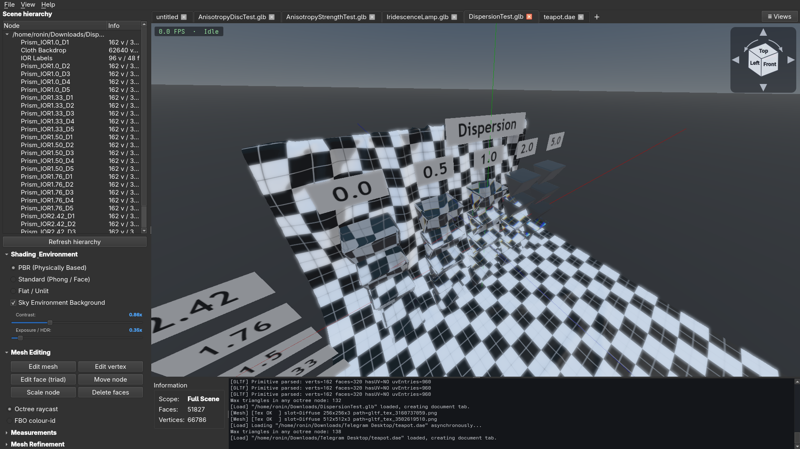
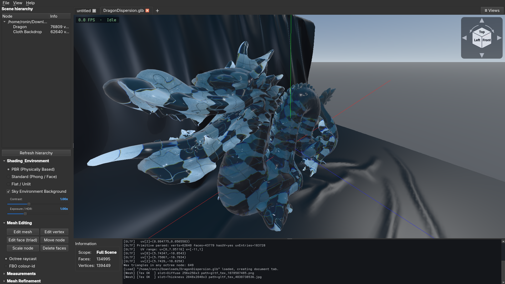

Tried to implement the Khronos PBR architecture in a custom OpenGL renderer. The renderer is capable of loading glTF 2.0 models and applying various material extensions, including clearcoat, sheen, anisotropy, iridescence, transmission, volume, index of refraction, specular, emissive strength, and diffuse transmission.

but the renderer is still a work in progress. I guess i will never finish it up , so feel free to use it as you wish.
